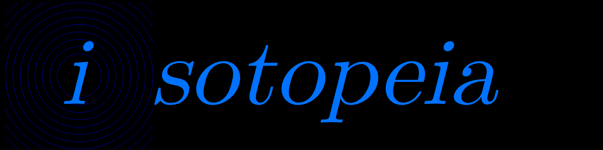

 
&nbsp;

Welcome to Isotopeia, a clicker game based off of a terrible misunderstanding of particle physics and a general carelessness not to learn more about it.
Do you want to play? Go  <a href="https://github.com/matthyno/Isotopeia/wiki/Getting-Started">here</a> to help you get started. It may look intimidating at first (and maybe you won't play it) but the Getting started page in the wiki should help.
By the way, there's a modding API. Learn stuff on modding at our <a href="https://github.com/matthyno/Isotopeia/wiki/Modding">wiki</a>, and more!
