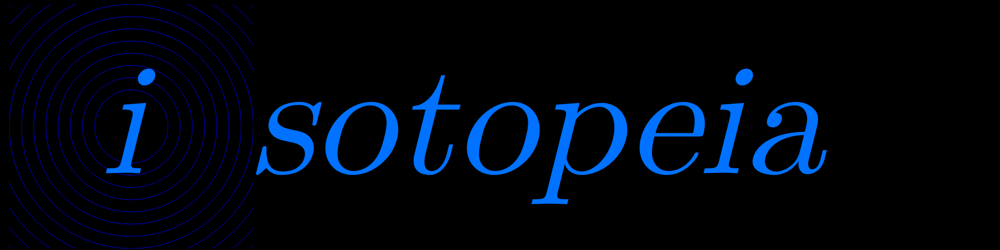

 
&nbsp;

Welcome to Isotopeia, a clicker game based off of a terrible misunderstanding of particle physics and a general carelessness not to learn more about it.
<h2>For players</h2>
Do you want to play? Go <a href="https://isotopeia.github.io/Isotopeia/">here</a> to start playing now, or <a href="https://github.com/matthyno/Isotopeia/wiki/Getting-Started">here</a> to help you get started. It may look intimidating at first but the Getting started page in the wiki should help. You can also just go in blind and play the game with no guides.
<h2>For modders</h2>
There's a modding API via JSON (and JavaScript via <code>customBehaviors</code> in JSON if you dare). Learn stuff on modding at our <a href="https://github.com/matthyno/Isotopeia/wiki/Modding">wiki</a>, or in <code>stock-buildings.json</code> (which is where the JSON files for the game's stock buildings are stored).
